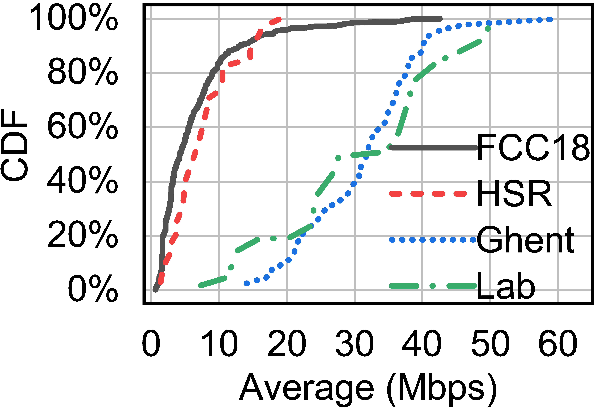

 # PiTree Traces

## About
We provide four sets of traces for the emulation:
- **FCC18** is the measurement results of the broadband network in 2018 provided by FCC, with a median bandwidth improvement by 4.04x compared to 2016. [(origin)](https://www.fcc.gov/reports-research/reports/measuring-broadband-america/)
- **HSR**. We adopt the 4G measurements on high-speed rails in 2018 to construct a scenario with violently fluctuating 4G bandwidths. [(origin)](https://github.com/superlitong/hsr_mptcp)
- **Ghent**. We use the 4G measurements on foot, bicycle, bus, tram, train, and car in 2016 by Ghent University, which are moderately fluctuating 4G bandwidths. [(origin)](https://users.ugent.be/~jvdrhoof/dataset-4g/)
- **Lab**. Finally, we also measure the indoor 4G bandwidth during the period of 2019-07-02 to 2019-08-15. To ensure the comprehensiveness of the dataset, we interchangeably use four congestion control algorithms (BBR, Cubic, Vegas, and HighSpeed). The indoor traces construct a scenario with gently fluctuating 4G bandwidths.

## Format

### Simulation
Each line of the file is in the following format:
~~~
timestamp bandwidth
~~~
The units of timestamp and bandwidth are *second* and *Mbps*.

The dataset could be directly downloaded with [this link](hd_sim.zip).

### Mahimahi

The size of the [Mahimahi](https://mahimahi.mit.edu)-format traces is too large. Therefore, we provide a [script](sim2mahimahi.py) to convert the sim-format traces to mahimahi-format.

Usage of sim2mahimahi.py:
~~~
python sim2mahimahi.py -i hd_sim/ghent/ -o hd_mahimahi/ghent/
~~~

## Statistics

